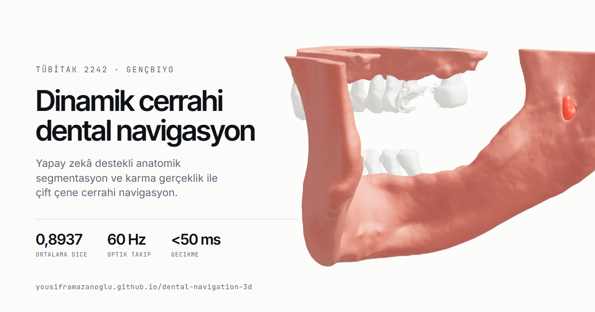

# 3B Dental Navigasyon — Yapay Zekâ Destekli Dinamik Cerrahi Navigasyon Sistemi

**Canlı site:** https://yousiframazanoglu.github.io/dental-navigation-3d/
**Sunum:** https://yousiframazanoglu.github.io/dental-navigation-3d/sunum.html ·
**English:** https://yousiframazanoglu.github.io/dental-navigation-3d/en.html ·
**العربية:** https://yousiframazanoglu.github.io/dental-navigation-3d/ar.html

Dental implantoloji ve lokal anestezi uygulamalarında komplikasyon riskini azaltmayı hedefleyen,
yapay zekâ destekli **dinamik cerrahi dental navigasyon sistemi**nin tanıtım sitesi ve üç boyutlu
görselleştirme katmanı. TÜBİTAK 2242 Üniversite Öğrencileri Araştırma Proje Yarışması — 2026
Sağlık kategorisi. Takım **GençBiyo**.



---

## Proje ne yapıyor

Alt çene implant cerrahisinin en ciddi riski **alt alveoler sinir** hasarıdır: implant mandibular
kanala 1 mm'den yakın yerleştirildiğinde nörosensöryel bozukluk kaçınılmazdır
(Peña-Cardelles vd., 2025). Buna karşın planlama halen büyük ölçüde iki boyutlu radyografiler
üzerinden yürütülür.

Bu sistem üç katmanlı bir mimariyle çalışır:

| Katman | Teknoloji | İşlev |
|---|---|---|
| Segmentasyon | Python · **nnU-Net v2** | CBCT hacminden yedi anatomik yapıyı otomatik çıkarır |
| Navigasyon | C++ · **NDI Polaris** | Alet ucunu 60 Hz izler, HU kemik yoğunluğu analizi, hibrit güvenlik algoritması |
| Arayüz | Unity · **MRTK3** · **HoloLens 2** · WPF | Holografik katman + masaüstü klinik kontrol istasyonu |

**Güvenlik eşikleri:** mandibular sinir kanalı 2,0 mm · maksiller sinüs 1,5 mm ·
foramen (iğne) 3,0 mm. Eşiklerin tamamı klinik literatürden alınmıştır.

---

## Segmentasyon sonuçları

nnU-Net v2, MICCAI 2024 **ToothFairy2** veri seti üzerinde (480 CBCT hacmi, 3d_fullres,
100 epoch, RTX 5070 Ti, ~3,5 saat) eğitildi. Aşağıdaki değerler eğitimin ürettiği doğrulama
çıktısından (`summary.json`, 96 vaka) okunmuştur.

| Anatomik yapı | Dice | Etiketli vaka |
|---|---:|---:|
| Alt çene (mandibula) | **0,9845** | 96 |
| Farenks | 0,9636 | 96 |
| Alt dişler | 0,9195 | 90 |
| Üst dişler | 0,8996 | 69 |
| Maksiller sinüs | 0,8742 | 13 |
| **Alt alveoler kanal** | **0,8511** | 96 |
| Üst çene (maksilla) | 0,7635 | 36 |
| **Ortalama** | **0,8937** | — |

> **Ölçüm notu.** Doğrulama kümesinin tamamında ham ortalama **0,7405**'tir. Fark modelden değil
> referans etiketlerin bütünlüğünden gelir: ToothFairy2 hacimlerinin bir bölümü kısmi anotasyonludur
> ve bazı yapılar hiç işaretlenmemiştir. Bu vakalarda model yapıyı doğru segmente etse dahi
> karşılaştırılacak referans olmadığı için Dice sıfır kaydedilir — maksiller sinüs 96 vakanın yalnız
> 13'ünde etiketlidir. Tablodaki değerler, her yapının **referansta bulunduğu vakalar** üzerinden
> hesaplanmıştır; kısmi etiketli veri setlerinde standart yaklaşım budur. Her iki değer de
> açıkça raporlanmaktadır.

---

## Bu depo ne içeriyor

Tanıtım sitesi ve üç boyutlu görselleştirme katmanı. **Klinik yazılımın kendisi (WPF kontrol
istasyonu, Unity/HoloLens arayüzü, eğitim hattı) bu depoda değildir.**

Sitedeki çene modeli bir çizim ya da hazır varlık değil: projenin kendi segmentasyon çıktısından
(`.mha` maskesi) marching-cubes ile üretilmiştir. Üretim betiği: [`scripts/build_jaw.py`](scripts/build_jaw.py).

```
index.html         Türkçe ana sayfa
en.html            İngilizce sürüm
ar.html            Arapça sürüm (dir="rtl")
sunum.html         19 slaytlık, klavyeyle gezilen sunum (3B modeller canlı)
src/scene.js       three.js sahnesi — kaydırmaya bağlı kamera koreografisi
src/device.js      HoloLens 2 modeli (sürüklenebilir)
src/rtl.css        sağdan sola katmanı — yalnız ar.html yükler
scripts/build_jaw.py   segmentasyon maskesinden GLB üretimi
scripts/charts.cjs     grafikleri tr/en/ar olarak üretir
```

**Arapça sürüm hakkında.** `rtl.css`, IBM Plex Sans Arabic'i `unicode-range`
ile mevcut Latin ailelerine ekler; böylece `style.css`'teki hiçbir seçici
değişmeden Latin glifler Inter'de, Arapça glifler Plex Arabic'te render edilir.
Arapça bitişik bir yazıdır: harf aralığı ve büyük harf dönüşümü kapatılır,
satır aralığı artırılır. Sayılar ve birimler (`<50 ms` gibi) `direction:ltr`
ile yalıtılır, yoksa ters okunur. Üç boyutlu sahnenin yatay kamera ofseti de
aynalanır — metin sağda olduğu için çene sola geçer.

## Çalıştırma

```bash
npm install
npm run dev      # http://localhost:4180
npm run build    # dist/ — statik, her yere dağıtılabilir
```

Teknoloji: **three.js** · Lenis · Vite. `main` dalına her push'ta GitHub Actions ile
GitHub Pages'e dağıtılır.

---

## Ekip

- **Noor Ahmed Hussein AL-GBURİ** — Takım Kaptanı · Proje Yürütücüsü. Klinik gereksinim analizi,
  cerrahi iş akışı tasarımı, anatomik etiketleme ve doğrulama.
  İstanbul Gelişim Üniversitesi, Diş Hekimliği Fakültesi öğrencisi.
- **Yousif Mustafa Hamid ALRAMDHAN** — Yazılım mimarisi ve geliştirme. Karma gerçeklik arayüzü,
  klinik kontrol istasyonu, yapay zekâ segmentasyon hattı.
  Bartın Üniversitesi, Bilgisayar Mühendisliği öğrencisi.

Takım GençBiyo · Başvuru No 1139B422600916

## Lisans ve atıf

HoloLens 2 üç boyutlu modeli: ["Hololens 2"](https://sketchfab.com/3d-models/hololens-2-3dd665394e6f4b62ba16338e55828ddd)
— [Faber](https://sketchfab.com/muertoHambre), [CC BY 4.0](http://creativecommons.org/licenses/by/4.0/).
Veri seti: ToothFairy2 (Cipriano vd., 2022; MICCAI 2024), CC-BY-SA 4.0.

---

<sub>Anahtar kelimeler: 3D dental navigasyon, dinamik cerrahi navigasyon, dental implant navigasyon,
alt alveoler kanal segmentasyonu, mandibular kanal, CBCT segmentasyon, nnU-Net v2, HoloLens 2,
karma gerçeklik, diş hekimliğinde yapay zekâ, TÜBİTAK 2242</sub>
